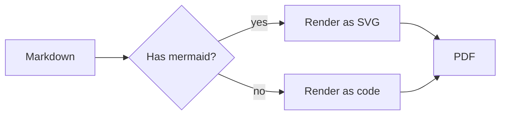
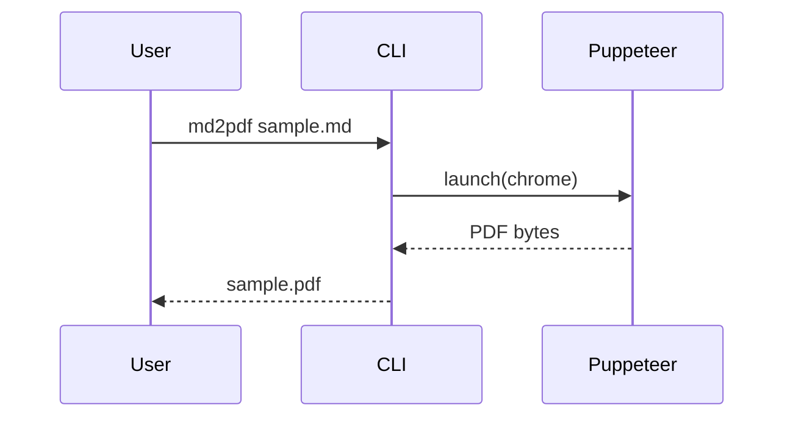

# md2pdf — kitchen-sink sample

A quick tour of everything the converter supports.  See [the linked page](./linked.md) for the BFS-walker demo.

## Headings & typography

> Blockquotes look like this.  They're useful for callouts and pull quotes.

Inline styles: **bold**, *italic*, ~~strike~~, `inline code`, and a <kbd>⌘K</kbd> keystroke.

Emoji via shortcodes: :rocket: :sparkles: :coffee: :tada:

---

## Lists

Unordered:

- first
- second
  - nested
  - also nested
- third

Ordered:

1. prepare
2. execute
3. celebrate

Task list:

- [x] implement renderer
- [x] add mermaid support
- [ ] add watch mode *(later)*

## Tables

| Language | Year | Cool? |
| -------- | ---: | :---: |
| C        | 1972 |   ✓   |
| Rust     | 2010 |   ✓   |
| JavaScript | 1995 | ✓ |
| COBOL    | 1959 |   —   |

## Code highlighting

```js
// JavaScript
export const greet = (name = "world") => `hello, ${name}!`;
console.log(greet("bun"));
```

```python
# Python
def fib(n):
    a, b = 0, 1
    for _ in range(n):
        a, b = b, a + b
    return a
```

```rust
// Rust
fn main() {
    let v: Vec<i32> = (1..=5).map(|x| x * x).collect();
    println!("{:?}", v);
}
```

```bash
# Shell
for f in *.md; do
  md2pdf "$f" -o "${f%.md}.pdf"
done
```

```sql
SELECT id, name, created_at
FROM users
WHERE last_seen > NOW() - INTERVAL '7 days'
ORDER BY created_at DESC;
```

## Math

Inline math: $E = mc^2$ and $\sum_{i=1}^{n} i = \frac{n(n+1)}{2}$.

Display math:

$$
\int_{-\infty}^{\infty} e^{-x^2}\, dx = \sqrt{\pi}
$$

## Mermaid diagrams





## Footnotes

Markdown supports footnotes[^1] with nice linking[^long].

[^1]: Like this one.
[^long]: Footnotes can span multiple lines and contain **formatting**.

## Image

_(Uses `file://` resolution for local images — see the README.)_
